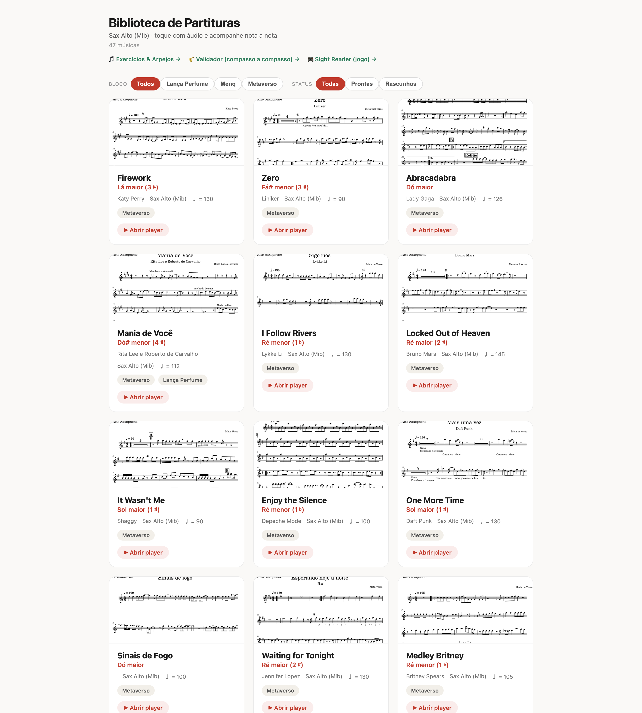
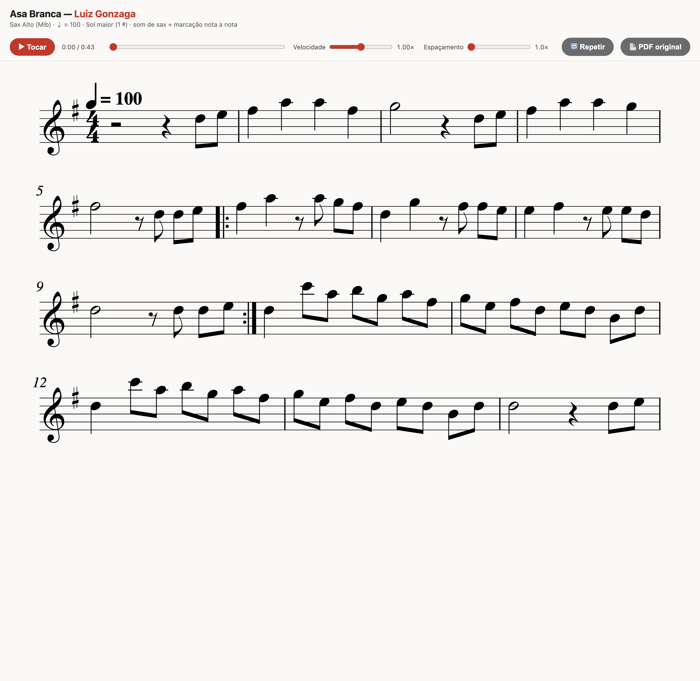
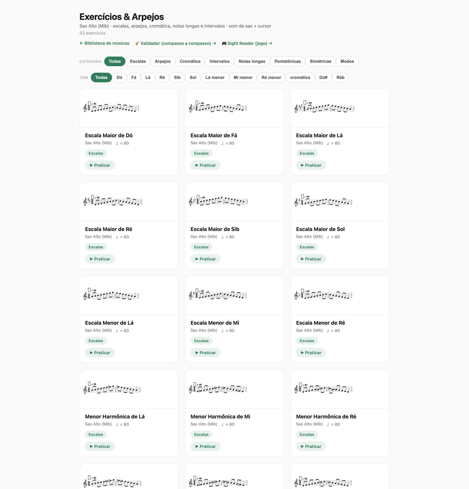

<h1 align="center">🎷 Biblioteca de Partituras — Sax Alto (Mib)</h1>

<p align="center">
  <b>Players "karaokê" para partitura de saxofone.</b><br>
  Toca a música com timbre de sax e um cursor acompanha a partitura <b>nota a nota</b> —
  tudo em HTML, direto no navegador, sem instalar nada.
</p>

<p align="center">
  <a href="https://vitorfornaro.github.io/awesome-music-sheets/"><b>▶ Abrir a demo ao vivo</b></a>
  &nbsp;·&nbsp;
  <a href="#-como-funciona">Como funciona</a>
  &nbsp;·&nbsp;
  <a href="#-rodando-localmente">Rodando localmente</a>
  &nbsp;·&nbsp;
  <a href="#-adicionar-uma-música-nova">Adicionar música</a>
</p>

<p align="center">
  
  
  
  
  
  
</p>

<p align="center">
  
</p>

---

## ✨ O que é isto

Este projeto transforma **PDFs de partitura de sax alto** (exportados do MuseScore) em
**players HTML interativos**. Cada player é um "karaokê" de partitura:

- 🔊 **Toca o áudio** com timbre de saxofone sintetizado;
- 🎯 **Cursor nota a nota** — um retângulo acompanha exatamente a nota que está soando;
- 🐢 **Velocidade ajustável** (0,25×–1×) para estudar trechos difíceis;
- 🔁 **Repetições, casas 1ª/2ª e D.S.** respeitadas no áudio e no cursor;
- 📄 **Comparação com o PDF original** com um clique;
- 🖱️ **Clique num compasso** para começar a tocar a partir dele.

Além das músicas, há uma **biblioteca de exercícios técnicos** (escalas, arpejos,
pentatônicas, modos, cromática…) gerados programaticamente, e um **Sight Reader**
(joguinho de leitura à primeira vista).

Tudo é **self-contained**: cada `_player.html` embute o SVG da partitura, o MP3 (base64)
e o PDF original inline. Você pode baixar um arquivo e abri-lo offline, sem servidor.

## 🖼️ Demonstração

|  |  |
|---|---|
| **Player karaokê** — partitura + controles de reprodução | **Exercícios & Arpejos** — biblioteca técnica gerada |
|  |  |

> **▶ [Experimente a demo ao vivo](https://vitorfornaro.github.io/awesome-music-sheets/)** — abre a
> Biblioteca completa; é só clicar em qualquer música e apertar *Tocar*.

## 📚 O que tem na biblioteca

- **47 músicas** organizadas em blocos: **Metaverso** (pop/internacional — Katy Perry,
  Lady Gaga, Queen, The Weeknd, Daft Punk…), **Menq** (repertório junino/forró — Luiz
  Gonzaga, baião, xote, frevo…) e **Lança Perfume**.
- **53 exercícios** em 8 categorias: Escalas (15), Arpejos (9), Pentatônicas (9),
  Simétricas (9), Modos (7), Intervalos (2), Cromática (1) e Notas longas (1).

Todas as alturas são **escritas** (o que o sax lê), com a transposição de instrumento
em Mib já resolvida.

## 🧭 Páginas principais

Abrindo por [`index.html`](index.html) você cai na Biblioteca. A partir dela chega em tudo:

| Página | O que é |
|---|---|
| **`Biblioteca.html`** | Página inicial — grade de cards de todas as músicas, com filtro por bloco e status. |
| **`Exercicios.html`** | Escalas, arpejos e demais exercícios, com filtro por categoria e tom. |
| **`Validador.html`** | Conferência compasso a compasso (transcrição × PDF original) para revisar a fidelidade. |
| **`SightReader.html`** | Jogo de leitura à primeira vista — o sistema mostra uma nota, você acerta. |
| `songs/<slug>/<slug>_player.html` | O player karaokê de cada música. |

## ⚙️ Como funciona

O coração do projeto é um **pipeline de OMR vetorial + engraving**. Em vez de "ler" a
imagem da partitura (OMR clássico), ele lê os **glifos SMuFL e os vetores** que o
MuseScore embute no PDF — o que é muito mais fiel.

```
  PDF (MuseScore)
        │  tools/vector_extract.py  ── lê glifos SMuFL + pauta/hastes/beams via PyMuPDF
        ▼                              detecta tom, andamento, fórmula, repetições, tercinas
   spec.json  ······································  fonte da verdade musical (por compasso)
        │  tools/build_from_spec.py ── beaming por tempo, ties/slurs, repetições, casas 1ª/2ª
        ▼
   <slug>.musicxml
        │  tools/make_song.py  (orquestra) ┐
        ▼                                   ├─ verovio ─► SVG + timemap (sincronia do cursor)
   MIDI ──► síntese aditiva (numpy) ──► MP3 ┘   com timbre de sax
        │
        ▼
   <slug>_player.html   (SVG + MP3 + PDF embutidos)  +  QA  +  thumb  +  página de validação
        │
        ▼
   songs.json ──► Biblioteca.html
```

**Detalhes que fazem diferença:**

- **Sincronia do cursor** vem do *timemap* do verovio: cada `note-id` no SVG é casado com
  o tempo exato no MP3, então o retângulo cai sempre na nota certa.
- **Repetições reais** (`|: :|` e casas 1ª/2ª) são desdobradas pelo verovio tanto no áudio
  quanto no cursor. D.S./D.C. é tratado à parte (o verovio não desdobra sozinho).
- **QA que trava a publicação:** todo compasso precisa fechar na fórmula, os IDs do SVG têm
  que bater 100% com o timemap, e a contagem de cabeças de nota do PDF é comparada com a
  transcrição (`tools/qa_notecount.py`) para pegar o erro clássico de "nota que sumiu".
- **Timbre de sax** é síntese aditiva em NumPy (sem soundfont/fluidsynth) — consistente e
  sem dependências pesadas.

## 🗂️ Estrutura do repositório

```
awesome-music-sheets/
├── index.html            # redireciona para a Biblioteca (entrada do GitHub Pages)
├── Biblioteca.html       # página inicial — todas as músicas em cards  (gerada)
├── Exercicios.html       # biblioteca de exercícios técnicos           (gerada)
├── Validador.html        # conferência compasso a compasso             (gerada)
├── SightReader.html      # jogo de leitura à primeira vista
├── songs.json            # manifesto das músicas
├── exercicios.json       # manifesto dos exercícios
├── requirements.txt      # dependências do pipeline (Python)
├── CLAUDE.md             # guia técnico detalhado do projeto / pipeline
├── tools/                # o pipeline (scripts Python + template do player)
│   └── README.md         # documentação de cada script
├── songs/
│   └── <slug>/           # uma pasta por música, self-contained
│       ├── source.pdf            # PDF original (fonte da verdade visual)
│       ├── spec.json             # transcrição por compasso (fonte da verdade musical)
│       ├── <slug>.musicxml
│       ├── <slug>_player.html    # o player karaokê
│       ├── <slug>_validacao.html # validação compasso a compasso
│       └── thumb.png             # miniatura
└── exercicios/           # mesma ideia, para os exercícios gerados
```

> Os arquivos de scratch/QA (`songs/*/work/`) e artefatos intermediários (`.wav`, `.mid`,
> `.mp3` soltos) ficam no `.gitignore` — são regeneráveis pelo pipeline. O áudio final já
> vai embutido em base64 dentro de cada `_player.html`.

## 🚀 Rodando localmente

Não precisa instalar nada só para **ver** os players — são HTML estático:

```bash
git clone https://github.com/vitorfornaro/awesome-music-sheets.git
cd awesome-music-sheets

# opção 1: abra o arquivo direto
open Biblioteca.html            # macOS  (no Linux: xdg-open)

# opção 2: sirva localmente (evita cachê teimoso do file:// no Chrome)
python3 -m http.server 8000     # depois abra http://localhost:8000/Biblioteca.html
```

Para **regenerar players ou adicionar músicas**, instale o pipeline:

```bash
python3 -m pip install -r requirements.txt
# além do pip: ffmpeg e poppler  (ex.: brew install ffmpeg poppler)
```

## 🎼 Adicionar uma música nova

Rode **da raiz do projeto**. Crie a pasta antes: `mkdir -p songs/<slug>/work`.

```bash
# 1) transcrição vetorial do PDF -> spec.json (+ recortes p/ a validação)
python3 tools/vector_extract.py "nova.pdf" --out songs/<slug>/spec.json \
    --crops songs/<slug>/work/vcrops          # opcional: --sharps N --tempo N

# 2) spec.json -> MusicXML
python3 tools/build_from_spec.py songs/<slug>/spec.json songs/<slug>/<slug>.musicxml

# 3) publica tudo (player + mp3 + thumb + validação + songs.json + Biblioteca)
python3 tools/make_song.py --mxml songs/<slug>/<slug>.musicxml --pdf "nova.pdf" \
    --bpm 120 --title "Nome" --artist "Artista" --key "Lá maior (3 ♯)" \
    --bloco "Metaverso" --slug <slug> --render-dir songs/<slug>/work
```

Se a transcrição precisar de acerto fino, **edite o `songs/<slug>/spec.json` na mão** (ele é a
fonte da verdade e pode ter correções que o extrator não reproduz) e repita os passos 2 e 3.
Não rode o `vector_extract` por cima de um `spec.json` existente.

📖 Passo a passo completo, regras de transcrição e detalhes de cada script:
**[`CLAUDE.md`](CLAUDE.md)** e **[`tools/README.md`](tools/README.md)**.

## 🛠️ Stack

- **[music21](https://web.mit.edu/music21/)** — modelo musical (spec → MusicXML, beaming, ties/slurs).
- **[verovio](https://www.verovio.org/)** — engraving MusicXML → SVG + *timemap*.
- **[PyMuPDF](https://pymupdf.readthedocs.io/)** — leitura vetorial dos glifos do PDF.
- **NumPy** — síntese aditiva do timbre de sax.
- **Pillow / CairoSVG / OpenCV** — miniaturas, render e QA visual.
- **HTML/CSS/JS puro** — os players, sem frameworks.

## 📄 Licença

O **código** (pasta `tools/`, templates e geradores) está sob licença **MIT** — veja
[`LICENSE`](LICENSE). As **partituras, áudios e PDFs** das músicas populares podem estar
sujeitos a direitos autorais de seus titulares e são disponibilizados apenas para estudo
pessoal e demonstração técnica. Os exercícios são gerados programaticamente.

---

<p align="center"><sub>Feito para estudar sax 🎷 — transcrição fiel, som na hora e o curso certo na nota certa.</sub></p>
